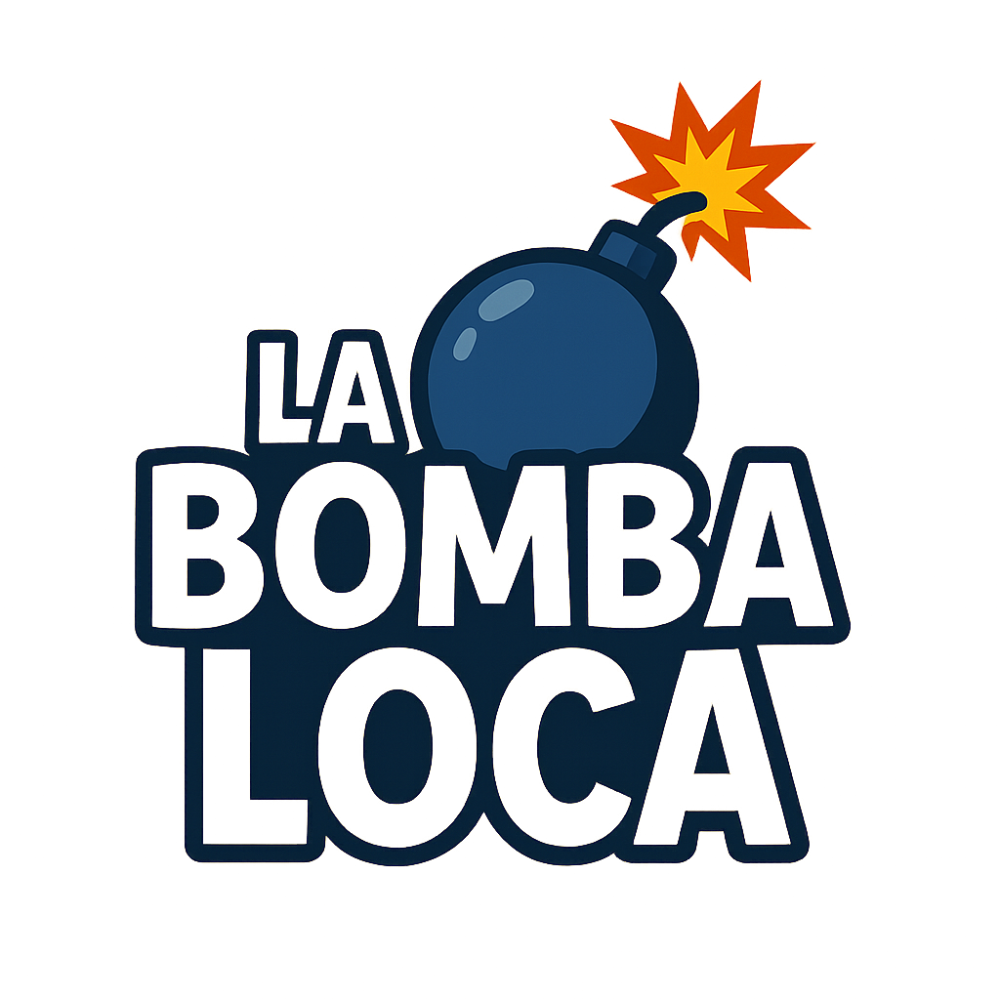

# 💣 Bomba Loca - Geografía Argentina 🇦🇷

<div align="center">
  
  
  **¡El juego más emocionante para aprender geografía argentina!**
  
  *¿Podrás salvar a Argentina de la explosión?* 💥🇦🇷
</div>

---

## 🎭 La Historia

🚨 **¡ALERTA NACIONAL!** 🚨

La malvada **Bomba Loca** ha conectado una serie de explosivos por toda Argentina. Para desactivarlos, debes cortar los cables en un orden específico, ¡uno por cada provincia!

<div align="center">
  
  
  *La villana Bomba Loca amenaza Argentina*
</div>

Si cortas un cable incorrecto, la bomba se dañará progresivamente. **¡Solo tienes 3 oportunidades antes de que Argentina explote!**

Tu misión es salvar a nuestro país. ¿Estás listo para el desafío?

---

## 🎮 Cómo Jugar

### 🎯 Objetivo
Encuentra y haz clic en las **23 provincias argentinas** en el orden que te indique el juego. ¡Cada provincia es un cable que debes cortar para desactivar la bomba!

### 🕹️ Controles del Mapa
- **🔍 Zoom In/Out**: Botones `+` y `-` 
- **🧭 Navegación**: Flechas direccionales (⬆️⬇️⬅️➡️)
- **🎯 Reset**: Botón de reset para volver a la posición inicial
- **👆 Selección**: Toca directamente sobre las provincias

### 💣 Sistema de Vidas
La bomba cambia de apariencia según el daño recibido:
- **🟢 Bomba Sana**: 3 vidas restantes
- **🟡 Bomba Dañada**: 2 vidas restantes  
- **🔴 Bomba Crítica**: 1 vida restante
- **💥 EXPLOSIÓN**: ¡Game Over!

---

## 🎵 Experiencia Audiovisual

### 🔊 Efectos de Sonido
- ✅ **Respuesta correcta**: Sonido de éxito
- ❌ **Respuesta incorrecta**: Sonido de error
- 💥 **Explosión final**: Audio dramático nuclear

### 🎆 Efectos Visuales
- **🎉 Victoria**: Animación celebratoria con mensaje épico
- **💥 Explosión**: Múltiples explosiones GIF con efectos escalados
- **⚡ Feedback**: Las provincias parpadean en rojo/verde según la respuesta

---

## 🗺️ Mecánica del Juego

1. **📖 El juego te muestra el nombre de una provincia**
2. **🎯 Tú debes hacer clic en la provincia correcta en el mapa**
3. **✅ Si aciertas:**
   - La provincia se pinta de verde (desactivada)
   - Suena un efecto de éxito
   - Pasas a la siguiente provincia
4. **❌ Si fallas:**
   - La provincia parpadea en rojo
   - La bomba se daña (pierdes una vida)
   - El dispositivo vibra (feedback háptico)
5. **🏆 Victoria**: "¡SALVASTE A ARGENTINA! ¡Desactivaste la Bomba Loca a tiempo!" 🎉🇦🇷
6. **💀 Derrota**: "¡EXPLOTÓ ARGENTINA! ¡La Bomba Loca ganó esta vez!" 💥🇦🇷

---

## 📖 Provincias Argentinas

El juego incluye las **23 provincias** con geometrías precisas basadas en datos GeoJSON reales:

### 🌎 Regiones
- **Región Pampeana**: Buenos Aires, Córdoba, Entre Ríos, La Pampa, Santa Fe
- **Región Patagónica**: Chubut, Neuquén, Río Negro, Santa Cruz, Tierra del Fuego
- **Región Cuyo**: Mendoza, San Juan, San Luis
- **Región NOA**: Catamarca, Jujuy, La Rioja, Salta, Santiago del Estero, Tucumán
- **Región NEA**: Chaco, Corrientes, Formosa, Misiones

*Nota: El juego no incluye CABA ya que es la Capital Federal, no una provincia.*

---

## ✨ Características Técnicas

### 🎨 Interfaz
- **🗺️ Mapa vectorial interactivo** con provincias precisas
- **📱 Diseño responsivo** optimizado para móviles
- **🎮 Controles intuitivos** con botones dedicados
- **🎯 Panel de control compacto** en esquina inferior derecha

### 🔧 Funcionalidades
- **💣 Sistema de vidas visual** con iconos dinámicos
- **🎵 Audio integrado** con MediaPlayer
- **📳 Vibración háptica** en errores
- **🎞️ Animaciones GIF** para explosiones
- **🔀 Orden aleatorio** para mayor rejugabilidad
- **💾 Gestión de estado** completa del juego

### 🛠️ Tecnologías
- **📱 Android nativo** (Kotlin)
- **🎨 Custom Views** para renderizado del mapa
- **📊 GeoJSON** para geometrías precisas
- **🎬 Glide** para animaciones GIF
- **🎵 MediaPlayer** para audio
- **📐 Vector Drawables** para iconografía

---

## 🚀 Instalación

### 📱 Para Usuarios
1. Descarga el archivo `bomba-loca.apk`
2. Habilita "Fuentes desconocidas" en tu dispositivo Android
3. Instala la APK
4. ¡Presiona el ícono y comienza a salvar Argentina! 🇦🇷

### 👨‍💻 Para Desarrolladores

#### Compilación Rápida
```bash
./build-apk.sh
```

#### Compilación Manual
```bash
# Con Gradle Wrapper
./gradlew assembleDebug

# El APK se genera en:
# app/build/outputs/apk/debug/app-debug.apk
```

#### Requisitos del Sistema
- **Android SDK**: API 21+ (Android 5.0)
- **JDK**: 17+
- **Gradle**: 8.2
- **Kotlin**: 1.8.20

---

## 📁 Estructura del Proyecto

```
BombaLoca/
├── 📱 app/
│   ├── src/main/
│   │   ├── java/com/example/bombaloca/
│   │   │   ├── 🗺️ ArgentinaMapView.kt      # Vista custom del mapa
│   │   │   ├── 🎮 MainActivity.kt           # Lógica principal del juego
│   │   │   ├── 🚀 IntroActivity.kt          # Pantalla de introducción
│   │   │   ├── 🗂️ Province.kt               # Modelo de datos de provincias
│   │   │   └── 📊 ProvinceData.kt           # Cargador de datos GeoJSON
│   │   ├── res/
│   │   │   ├── 🎨 drawable/                 # Iconos y vectores
│   │   │   ├── 📱 layout/                   # Layouts de actividades
│   │   │   ├── 🖼️ mipmap-*/                 # Iconos de la aplicación
│   │   │   └── 🎵 raw/                      # Archivos de audio
│   │   └── 📦 assets/
│   │       ├── 📊 provinces_data.json       # Datos geográficos
│   │       └── 💥 explosion.gif             # Animación de explosión
├── 🖼️ bombaloca.png                         # Personaje villano
├── 🏷️ logo.png                              # Logo de la aplicación
├── 📝 README.md                             # Este archivo
└── 🔨 build-apk.sh                          # Script de compilación
```

---

## 🎯 Características Avanzadas

### 🎮 Experiencia de Usuario
- **🎭 Pantalla de introducción** con historia y personajes
- **🎯 Posicionamiento automático** del mapa al iniciar
- **🔍 Controles de zoom y navegación** optimizados
- **💣 Indicador visual de vidas** que se deteriora progresivamente
- **🎊 Mensajes épicos** de victoria y derrota

### 🔧 Optimizaciones Técnicas
- **⚡ Renderizado eficiente** con anti-aliasing
- **🎯 Detección precisa de clics** en formas complejas
- **📱 Gestión de memoria** optimizada para GIFs
- **🔄 Transformaciones de matriz** para zoom y pan suaves
- **📐 Cálculo dinámico de centrado** basado en La Pampa

---

## 🐛 Solución de Problemas

### ❓ Preguntas Frecuentes

**P: ¿Por qué no aparece CABA en el mapa?**  
R: CABA es la Capital Federal, no una provincia. El juego se enfoca en las 23 provincias argentinas.

**P: ¿El mapa se ve muy pequeño o descentrado?**  
R: Usa los controles de zoom (+/-) y las flechas direccionales para ajustar la vista.

**P: ¿No se escucha el audio?**  
R: Verifica que el volumen del dispositivo esté activado y que los permisos de audio estén habilitados.

### 🔧 Compilación
Si tienes problemas compilando:
1. Asegúrate de tener JDK 17+
2. Verifica que Android SDK esté instalado
3. Ejecuta `./gradlew clean` antes de compilar

---

## 🤝 Contribuciones

¡Las contribuciones son bienvenidas! 

### 🎯 Ideas para Contribuir
- 🌎 **Más países**: Agregar otros países de América Latina
- 🏆 **Niveles de dificultad**: Modo fácil/difícil
- ⏱️ **Modo cronometrado**: Desafío contra el tiempo
- 📊 **Estadísticas**: Tracking de progreso y records
- 🎨 **Temas visuales**: Diferentes estilos de mapa
- 🔊 **Más audio**: Música de fondo y efectos adicionales

### 📋 Cómo Contribuir
1. Fork el repositorio
2. Crea una rama para tu feature (`git checkout -b feature/nueva-funcionalidad`)
3. Commit tus cambios (`git commit -am 'Agrega nueva funcionalidad'`)
4. Push a la rama (`git push origin feature/nueva-funcionalidad`)
5. Crea un Pull Request

---

## 📄 Licencia

Este proyecto es de código abierto. ¡Úsalo, modifícalo y compártelo para educar y divertir! 🎓

---

## 🙏 Agradecimientos

- **🗺️ Datos geográficos**: Basados en información oficial de Argentina
- **🎨 Diseño**: Inspirado en juegos educativos clásicos
- **👥 Comunidad**: Gracias a todos los que han probado y mejorado el juego

---

<div align="center">
  
**¡Gracias por jugar Bomba Loca y aprender geografía argentina de manera divertida!** 

💣🇦🇷 **¡Salva Argentina, salva el día!** 🇦🇷💣

*¿Lograrás desactivar la Bomba Loca a tiempo?*

</div>